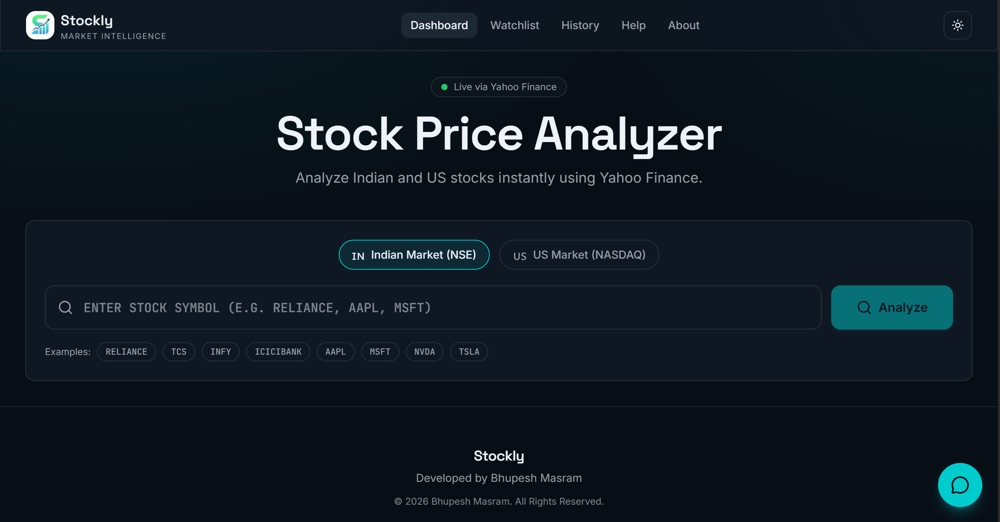
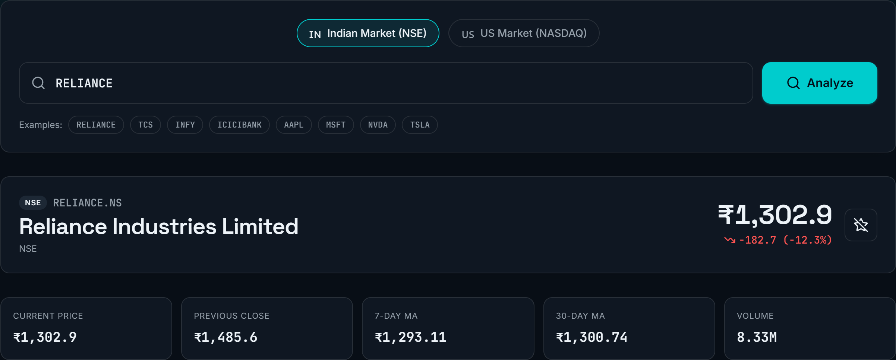
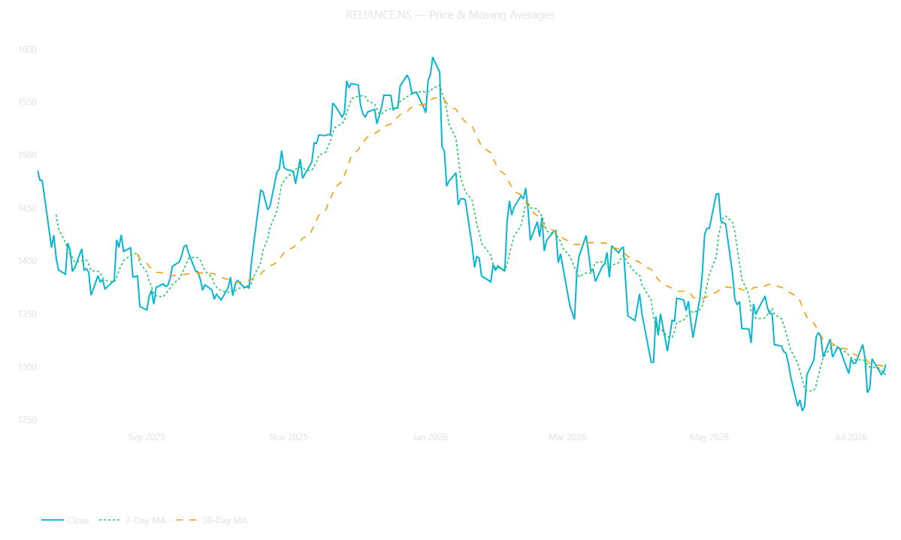
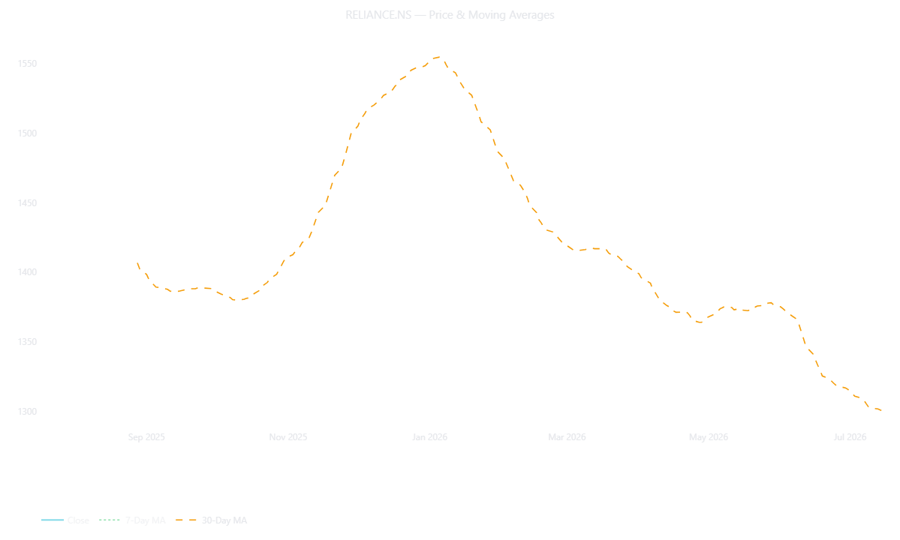

# 📈 Stockly – Stock Price Analyzer

A Python-powered stock market analysis application that enables users to analyze both Indian (NSE) and US (NASDAQ) stocks using live market data from Yahoo Finance.

The project began as a Python backend built with Pandas, Matplotlib, and yFinance. Later, it was transformed into a fully interactive web application using Lovable AI, making stock analysis accessible even for non-technical users.

---

## 🌐 Live Demo

🔗 https://stockly-analyzer.lovable.app

---

## 📸 Application Preview

### 🏠 Home Page

The home page provides a simple and beginner-friendly interface where users can select the stock market (NSE or NASDAQ), enter a stock symbol, and start analyzing live stock data.



---

### 📊 Stock Analysis Dashboard

After selecting a stock, the dashboard displays key information including the company name, current stock price, previous closing price, daily price change, percentage change, and AI-generated market insights.



---

### 📈 Historical Stock Price Analysis

This visualization shows the historical closing prices of the selected stock, helping users understand price trends over time.



---

### 📉 30-Day Moving Average Analysis

The 30-day moving average chart helps smooth out daily price fluctuations and provides a clearer view of the stock's overall trend.


---

# 🚀 Features

✅ Analyze both Indian (NSE) and US (NASDAQ) stocks

✅ Fetch live stock market data using Yahoo Finance

✅ Display:

- Company Name
- Current Stock Price
- Previous Closing Price
- Daily Price Change
- Percentage Change
- Currency

✅ Historical Stock Price Analysis

✅ 7-Day Moving Average

✅ 30-Day Moving Average

✅ Interactive Price Visualization

✅ AI-generated Short-Term Market Insight (Bullish / Bearish)

✅ Beginner-friendly interface

✅ Built-in Stock Symbol Assistant

✅ Dark Mode & Light Mode

✅ Download stock charts as images

---

# 📊 Project Workflow

```text
User Selects Market
        │
        ▼
Enter Stock Symbol
        │
        ▼
Fetch Live Data using yFinance
        │
        ▼
Extract Company Information
        │
        ▼
Calculate Daily Change
        │
        ▼
Calculate 7-Day Moving Average
        │
        ▼
Calculate 30-Day Moving Average
        │
        ▼
Generate Price Visualization
        │
        ▼
Display AI Market Insight
```

---

# 🛠 Technologies Used

### Programming Language

- Python

### Libraries

- Pandas
- Matplotlib
- yFinance
- datetime

### AI Platform

- Lovable AI

### Version Control

- Git
- GitHub

---

# ⚙ Backend Development

The backend was entirely developed in Python.

The application:

- imports financial data using **yFinance**
- processes market information using **Pandas**
- calculates moving averages
- visualizes stock prices using **Matplotlib**
- handles user interaction through Python loops and conditional statements

Key Python concepts used include:

- While Loops
- If-Else Statements
- Exception Handling
- Functions
- DataFrames
- Rolling Window Calculations
- Data Visualization

---

# 📈 Financial Metrics

The application provides:

- Current Price
- Previous Closing Price
- Daily Price Change
- Percentage Change
- Historical Closing Prices
- 7-Day Moving Average
- 30-Day Moving Average

These indicators help users understand short-term price trends and compare recent market performance.

---

# 🤖 AI-Powered Web Application

After completing the backend, the Python logic was transformed into a modern web application using **Lovable AI**.

Additional improvements include:

- Responsive UI
- Market Selection (NSE / NASDAQ)
- Stock Symbol Suggestions
- AI-generated Market Insights
- Dark & Light Theme
- Download Chart Feature
- Beginner-friendly Interface

The goal was to make stock analysis simple for users without requiring Python knowledge.

---

# 📂 Project Structure

```
stockly-stock-price-analyzer/

│
├── README.md
├── requirements.txt
├── .gitignore
│
├── backend/
│   └── stock_price_analyzer.py
│
├── screenshots/
│   ├── home.png
│   ├── dashboard.png
│   ├── graph.png
│   └── moving_average.png
│
└── assets/
```

---

# ▶ How to Run

Clone the repository

```bash
git clone https://github.com/Bhupesh456/stockly-stock-price-analyzer.git
```

Install dependencies

```bash
pip install -r requirements.txt
```

Run the backend

```bash
python backend/stock_price_analyzer.py
```

Or simply explore the live web application:

https://stockly-analyzer.lovable.app

---

# 🔮 Future Improvements

- RSI Indicator
- MACD Indicator
- Bollinger Bands
- Candlestick Charts
- Portfolio Tracker
- Stock Comparison
- Export Analysis to PDF
- Company News Integration

---

# 👨‍💻 About Me

Hi, I'm **Bhupesh Masram**.

I'm an aspiring Data Analyst with a strong interest in Financial Analytics, Python, SQL, Power BI, and Business Intelligence.

I enjoy building practical projects that transform raw data into meaningful insights and solve real-world business problems.

---

## 📬 Connect With Me

- LinkedIn: https://www.linkedin.com/in/bhupesh-masram/
- GitHub: https://github.com/Bhupesh456
- Medium: https://medium.com/@bhupeshmasram.143

---

⭐ If you found this project useful, consider giving it a star!
